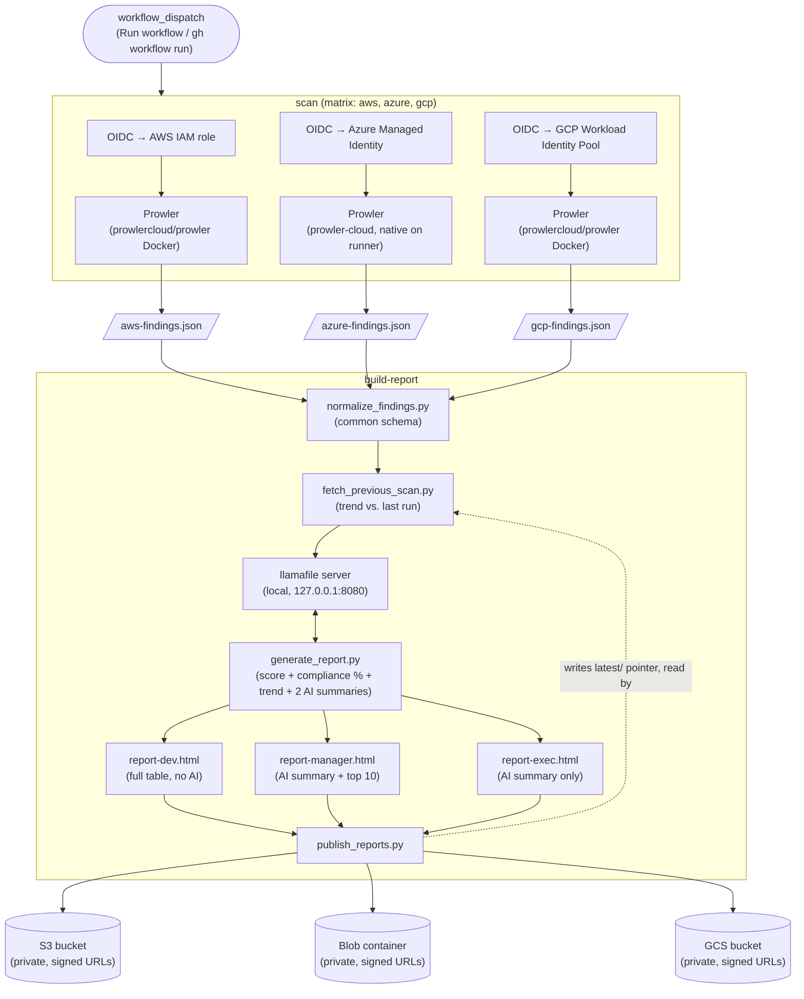

# prowler-multicloud-reporter

Run [Prowler](https://github.com/prowler-cloud/prowler) across AWS, Azure, and GCP with one click, and get back three audience-tiered reports as private, time-limited links — instead of a raw findings JSON: a technical report for engineers, a summary for team managers, and a plain-language executive summary for decision-makers.

## Components

Everything runs inside [GitHub Actions](https://docs.github.com/en/actions) — no database, no bot, no standalone compute to host:

| Component | What it does | Where |
|---|---|---|
| [Prowler](https://github.com/prowler-cloud/prowler) | Scans AWS/Azure/GCP (read-only) against security + compliance checks | `prowlercloud/prowler` Docker image (AWS, GCP), `prowler-cloud` PyPI package (Azure — see CLAUDE.md gotchas for why) |
| [llamafile](https://github.com/Mozilla-Ocho/llamafile) running [Llama-3.2-3B-Instruct](https://huggingface.co/mozilla-ai/Llama-3.2-3B-Instruct-llamafile) (Q4_K_M) | Writes the manager/exec narrative summaries — a small open-weight model running **entirely on the runner**, no cloud API call | `scripts/llm_client.py` |
| [boto3](https://boto3.amazonaws.com/v1/documentation/api/latest/index.html) (AWS) + [azure-identity](https://pypi.org/project/azure-identity/)/[azure-storage-blob](https://pypi.org/project/azure-storage-blob/) (Azure) + [google-cloud-storage](https://pypi.org/project/google-cloud-storage/) (GCP) | Report delivery to whichever cloud you point it at — private S3 bucket, Blob container, **or** GCS bucket, picked at runtime via `STORAGE_BACKEND` (`s3`/`azure-blob`/`gcs`), same signed-URL behavior across all three | `scripts/storage_backend.py` (one module, all three backends) |
| [Terraform](https://www.terraform.io/) (`hashicorp/aws`, `hashicorp/azurerm`, `hashicorp/google`) | One-time IAM role / managed identity / service account + storage bucket bootstrap | `infra/aws/`, `infra/azure/`, `infra/gcp/` |

## Architecture (v1)



This is intentionally v1-minimal; a chat-with-your-findings interface is still deferred (see "Not built yet" below) — the persistent findings history it would read from is already being built as a side effect of the trend feature below.

## The three reports

Same scan, same underlying findings, three depths — see `scripts/generate_report.py`. All three carry a **risk score**, **compliance framework percentages**, and a **trend line** ("N new, M resolved since last scan"):

| Profile | File | Content | AI? |
|---|---|---|---|
| Engineer | `report-dev.html` | Score + compliance % + trend, then every failing check: cloud, account, severity, detail, remediation | No — nothing to translate, they want the raw table |
| Manager | `report-manager.html` | Score + compliance % + trend, then a 4-5 sentence summary naming specific accounts/services + a table of the top 10 findings | Yes |
| Decision-maker | `report-exec.html` | Score + compliance % + trend, then a 2-3 sentence plain-business-language summary, no table, no jargon | Yes |

**Risk score** (`risk_score()`) is a deterministic 0-100 heuristic weighted by severity and normalized by total checks run — reproducible run to run, unlike asking an LLM to "rate this 0-100." **Compliance %** is computed the same deterministic way from Prowler's own compliance tags per finding — currently tracks PCI-DSS, HIPAA, AWS Foundational Security Best Practices, the CIS Microsoft Azure Foundations Benchmark, and the CIS Google Cloud Platform Foundation Benchmark (confirmed against real scan tag names for all three clouds, see `CLAUDE.md`); it's an approximation (checks passing / checks tagged), not a substitute for Prowler's own audit-grade compliance CSVs. **Trend** comes from `fetch_previous_scan.py` diffing the current run against whatever the last run left in storage; the first scan for an account just says so and skips the comparison.

Both AI summaries are generated from these same aggregated numbers (never raw findings or cloud access) with a system prompt that forbids inventing findings or changing severities (`scripts/llm_client.py`) — if the call fails, that report falls back to a templated summary rather than breaking.

## Running it locally (no cloud creds needed)

```bash
pip install -r scripts/requirements.txt

python scripts/normalize_findings.py \
  sample-data/prowler-aws-sample.json sample-data/prowler-azure-sample.json \
  > reports/findings.normalized.json

python scripts/generate_report.py reports/findings.normalized.json reports/ --no-ai
```

Writes `reports/report-dev.html`, `report-manager.html`, `report-exec.html` — open any of them in a browser. `--no-ai` skips the llamafile call and uses templated summaries.

## Two phases: setup once, run anytime

| | Setup | Run |
|---|---|---|
| **What it does** | Creates the IAM role/managed identity and the storage bucket/container | Scans (read-only), generates the 3 reports, uploads them to storage that already exists |
| **Changes real infrastructure?** | Yes — new IAM/RBAC, new storage account | No — nothing new is created, only used |
| **Who runs it** | **A human, once** (`terraform apply`, in their own terminal) | **Anyone/anything**, repeatably — clicking *Run workflow*, a schedule, or an agent triggering it via `gh workflow run` |
| **How often** | Once per cloud, or whenever the infra itself changes | Every time you want fresh reports |

Creating cloud infrastructure is the one action here that a human has to authorize directly — no chat instruction substitutes for actually typing `terraform apply` yourself. Once that's done, running a scan touches nothing new — read-only against the cloud, an upload into a bucket you already created — so there's nothing further to authorize each time.

## Setup (one-time, manual)

**1. Cloud scanning credentials.** `infra/aws/`, `infra/azure/`, and `infra/gcp/` are small, self-contained Terraform configs:

```bash
# AWS
cd infra/aws && terraform init && terraform apply -var="github_repository=<org>/<repo>"

# Azure
cd infra/azure && terraform init && terraform apply \
  -var="subscription_id=<sub-id>" -var="github_repository=<org>/<repo>"

# GCP
cd infra/gcp && terraform init && terraform apply \
  -var="project_id=<project-id>" -var="github_repository=<org>/<repo>"
```

**AWS** creates one IAM role (reusing your account's existing GitHub OIDC provider) with `SecurityAudit` + `ViewOnlyAccess` — never `AdministratorAccess`. Take the `role_arn` output, set it as the **`AWS_ROLE_ARN`** repo variable, then flip `use_sample_data` off.

**Azure** creates a User-Assigned Managed Identity + federated credential (same OIDC pattern, no client secret) with `Reader` on the subscription. Take the outputs and set `AZURE_CLIENT_ID`, `AZURE_TENANT_ID`, `AZURE_SUBSCRIPTION_ID` as repo variables.

**GCP** creates a Workload Identity Pool + service account (same OIDC pattern, no service account key ever created) with `roles/viewer` on a **dedicated project** (not your account's shared default project). Take the outputs and set `GCP_WORKLOAD_IDENTITY_PROVIDER`, `GCP_SERVICE_ACCOUNT_EMAIL`, `GCP_PROJECT_ID` as repo variables. See `infra/gcp/README.md` for the `github_repository_id` option, which makes this the only one of the three that survives a future repo rename without a manual re-apply.

All three applied and validated for real against a live AWS account, Azure subscription, and GCP project (see CLAUDE.md's Status log) — this repo, like everything else in this workspace, follows a "spin up to validate, tear down when not actively in use" pattern rather than leaving cloud resources running by default.

**2. AI summaries — no setup needed.** `LLM_BACKEND` has one value: llamafile runs entirely on the GitHub Actions runner (`scan.yml` downloads and starts it as a local OpenAI-compatible server before calling it) — no credentials, no account, no cloud infra, and real vulnerability findings never leave the runner.

**3. Delivery: a private link, served from wherever the scan ran.** No email, no bot, one link per report. `infra/aws/`, `infra/azure/`, and `infra/gcp/` each create a **private** storage backend (S3, Blob, GCS — never public), and `scripts/publish_reports.py` uploads all three reports plus the normalized findings, printing a time-limited signed URL per report (default 7-day expiry, `REPORT_URL_EXPIRY_SECONDS` to change it) into the GitHub Actions run summary. Pick the backend with `STORAGE_BACKEND` (`s3`, the default, `azure-blob`, or `gcs`) and set the matching variables (`S3_REPORTS_BUCKET`; `AZURE_STORAGE_ACCOUNT` + `AZURE_STORAGE_CONTAINER`; or `GCS_REPORTS_BUCKET` + `GCP_SERVICE_ACCOUNT_EMAIL`).

Uploading the findings JSON alongside the HTML reports also builds a per-run history in the same storage — `fetch_previous_scan.py` reads that history back on the *next* run to compute the trend line above.

**4. Chat delivery (optional).** Set the `SLACK_WEBHOOK_URL` repo variable to also get a ping in Slack when a scan finishes, linking to the run.

## Not built yet (deliberately deferred)

- **Chat-with-your-findings.** A natural-language Q&A layer over past scans (RAG on the normalized findings, never on live cloud access) — adds prompt-injection surface and ongoing LLM cost, worth doing only after the push-based report has proven its value.
- **Slack/Teams slash-command trigger.** Today "easy to run" means clicking *Run workflow* in the Actions tab. A `/prowler scan aws prod` chat command needs a hosted app (bot + OAuth) — more infra than v1 needed.
- **AI-drafted remediation tickets.** Explicitly deferred in favor of the score/compliance/trend features above — a mis-drafted summary is a lot less costly than a mis-drafted, actionable ticket.
